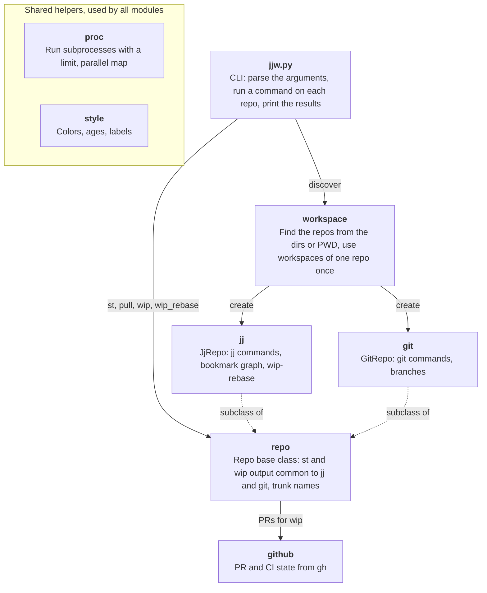

# libjjw

The logic of `jjw`. `bin/jjw.py` is the CLI. Dotter links it as `~/.local/bin/jjw`.

```mermaid
flowchart TD
    cli["<b>jjw.py</b><br/>CLI: parse the arguments, run a command on each repo, print the results"]
    workspace["<b>workspace</b><br/>Find the repos from the dirs or PWD, use workspaces of one repo once"]
    repo["<b>repo</b><br/>Repo base class: st and wip output common to jj and git, trunk names"]
    jj["<b>jj</b><br/>JjRepo: jj commands, bookmark graph, wip-rebase"]
    git["<b>git</b><br/>GitRepo: git commands, branches"]
    github["<b>github</b><br/>PR and CI state from gh"]

    subgraph shared["Shared helpers, used by all modules"]
        proc["<b>proc</b><br/>Run subprocesses with a limit, parallel map"]
        styles["<b>style</b><br/>Colors, ages, labels"]
    end

    cli -->|discover| workspace
    cli -->|"st, pull, wip, wip_rebase"| repo
    workspace -->|create| jj
    workspace -->|create| git
    jj -.->|subclass of| repo
    git -.->|subclass of| repo
    repo -->|PRs for wip| github
```
